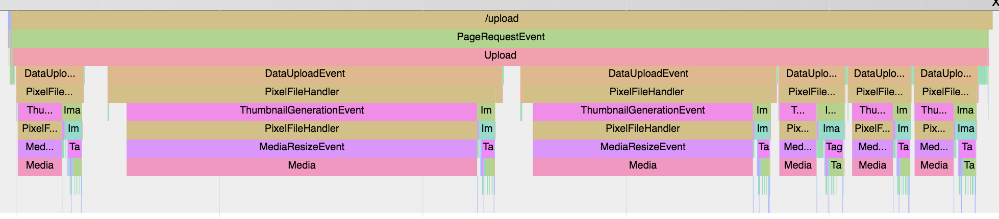

Generating Data:
----------------
Create tracer
```
from eventtracer import EventTracer
et = EventTracer("myeventlog.json")
```

Procedural API
```
et.begin("Eating Cake")
...
et.end()
```

Decorator API
```
@et.decorator
def foo():
    ...

foo()
```

Context Manager API
```
with et.context("doing stuff"):
    ...
```

Profiler API
```
et.set_profile(True)
```

If filename isn't specified, then data will be buffered
in-memory (`et.buffer`) and can be written to disk in
one go with `et.flush(filename)`.

Viewing Data:
-------------
Visit `chrome://tracing`

Load JSON file




Format Spec:
------------
[Google Doc](https://docs.google.com/document/d/1CvAClvFfyA5R-PhYUmn5OOQtYMH4h6I0nSsKchNAySU/edit)

Uses the JSON Array Format because that's the one which can be appended to from multiple threads


Packaging Howto:
----------------
Because I forget every time I need to do this...

```
vim setup.py  # change version
python3 setup.py sdist bdist_wheel
python3 -m twine upload dist/*
```
